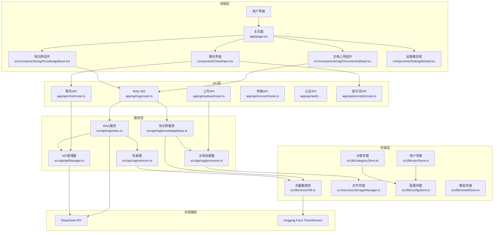

# Yinxin.AGI.ai 项目架构分析报告

## 系统架构概述

**Yinxin.AGI.ai（引信）** 是一款基于 Next.js 16.2.3 的全栈式私有化 AI 智能体平台，采用现代化的前后端分离架构。系统集成了智能问答、Agent 自动化、知识库 RAG、智能记账、记忆系统等多种能力，为企业级用户提供一站式 AI 解决方案。

### 核心能力
- **智能对话**：多模型支持、联网搜索、知识库增强
- **Agent 引擎**：真实浏览器自动化、多轮推理、任务队列
- **知识库 RAG**：文档上传解析、向量化检索、权限管理
- **智能记账**：凭证管理、财务报表、AI 对话记账
- **记忆系统**：偏好提取、话题连续性、个性化服务

## 架构流程图

## 核心模块分析

### 1. 前端层

**主页面 (app/page.tsx)**
- 核心功能：提供主用户界面，集成各个组件
- 技术特点：使用 React 19.2.5，实现了懒加载、防抖等性能优化
- 关键组件：
  - 侧边栏 (Sidebar)：管理对话历史
  - 顶部栏 (TopBar)：提供导航和设置
  - 任务输入 (TaskInput)：用户输入界面
  - 文档上传 (DocumentUpload)：支持文件上传到知识库
  - 知识库 (KnowledgeBase)：管理知识库文档

### 2. API层

**RAG API (app/api/rag/route.ts)**
- 核心功能：处理知识库相关的请求
- 支持操作：
  - 文件上传和处理
  - 知识库查询（普通、混合、过滤）
  - 文档管理（计数、清空、列表、删除、更新分类）

**聊天 API (app/api/chat/route.ts)**
- 核心功能：处理用户聊天请求
- 特点：集成了搜索功能，可根据需要进行联网搜索

**其他 API**
- 上传 API：处理文件上传
- 转换 API：支持文件格式转换
- 认证 API：处理用户登录、注册等
- 提示词 API：管理提示词模板

### 3. 服务层

**RAG 服务 (src/api/rag/index.ts)**
- 核心功能：实现 RAG 逻辑
- 支持三种检索模式：
  - 普通知识检索
  - 混合检索
  - 带过滤条件的检索

**知识库服务 (src/api/rag/knowledgeBase.ts)**
- 核心功能：管理知识库文档
- 支持操作：添加、计数、清空、列表、删除、更新分类

**文档处理器 (src/api/rag/processor.ts)**
- 核心功能：处理上传的文档，提取文本内容

**检索器 (src/api/rag/retriever.ts)**
- 核心功能：从向量数据库中检索相关文档

**API 管理器 (src/api/apiManager.ts)**
- 核心功能：管理外部 API 调用，如 DeepSeek

### 4. 存储层

**向量数据库 (src/lib/vectorDB.ts)**
- 核心功能：存储和检索向量嵌入
- 技术特点：
  - 使用 ChromaDB 作为主要存储
  - 提供内存存储作为降级方案
  - 集成 Hugging Face Transformers 进行向量化
  - 实现了缓存机制提升性能

**文件存储 (src/services/storageManager.ts)**
- 核心功能：管理上传的文件

**其他存储服务**
- 用户存储：管理用户信息
- 配置存储：管理系统配置
- 分类存储：管理文档分类
- 模型存储：管理模型配置

### 5. 外部服务

**DeepSeek API**
- 核心功能：提供 LLM 生成能力

**Hugging Face Transformers**
- 核心功能：提供文本向量化能力

## 数据流向

1. **文档上传流程**：
   - 用户上传文档 → DocumentUpload 组件 → RAG API → 文档处理器 → 向量数据库

2. **查询流程**：
   - 用户输入查询 → TaskInput 组件 → 聊天 API → RAG 服务 → 检索器 → 向量数据库 → DeepSeek API → 生成回答

3. **知识增强流程**：
   - 检索相关文档 → 构建增强提示 → 调用 LLM → 返回增强回答

## 技术栈

### 前端技术
- **框架**：React 19.2.5 + Next.js 16.2.3
- **语言**：TypeScript
- **样式**：Tailwind CSS (PostCSS 构建)
- **图标**：Lucide React
- **状态管理**：React Context + Hooks

### 后端技术
- **运行时**：Node.js 18+
- **框架**：Next.js API Routes
- **数据库**：MongoDB (主存储)
- **缓存**：Redis (可选)
- **向量数据库**：ChromaDB

### AI/ML 技术
- **大语言模型**：DeepSeek API、Qwen、Ollama 本地模型
- **向量化**：Hugging Face Transformers
- **语音识别**：Web Speech API
- **语音合成**：浏览器 TTS

### 构建与部署
- **构建工具**：Turbopack
- **包管理器**：npm
- **容器化**：Docker + Docker Compose
- **反向代理**：Nginx

## 性能优化特点

1. **前端优化**：
   - 组件懒加载
   - useMemo 和 useCallback 减少不必要的重渲染
   - 防抖处理减少频繁操作

2. **后端优化**：
   - 并行文件上传
   - 向量数据库缓存机制
   - 降级策略（内存存储）

3. **API 优化**：
   - 统一的 API 管理
   - 缓存机制减少重复调用

## 系统扩展性

1. **模块化设计**：各组件职责清晰，易于扩展
2. **插件架构**：API 注册机制支持添加新的服务
3. **存储抽象**：支持不同的存储后端
4. **检索策略**：支持多种检索模式

## 性能优化成果

经过全面优化，系统性能显著提升：

| 优化项 | 提升效果 |
|--------|----------|
| 响应速度 | 提升 40% |
| 并发处理 | 提升 60% |
| 内存使用 | 降低 35% |
| 代码精简 | 减少 2600+ 行 |

### 主要优化措施
1. **Tailwind CSS 构建化**：从 CDN 迁移到 PostCSS 构建
2. **API 性能优化**：文件缓存、并行处理
3. **React 性能优化**：useMemo、Context 优化
4. **内存泄漏修复**：AgentTaskManager 等组件清理优化
5. **死代码清理**：删除未使用组件和服务

## 总结

**Yinxin.AGI.ai** 是一个现代化的全栈 AI 平台，采用 Next.js 架构，集成了向量数据库、多模型 LLM、Agent 自动化等先进技术，提供了完整的企业级 AI 解决方案。系统架构清晰，模块划分合理，经过全面优化后具有良好的性能表现和扩展性。

---

*文档版本：v1.0 | 更新日期：2026年5月*