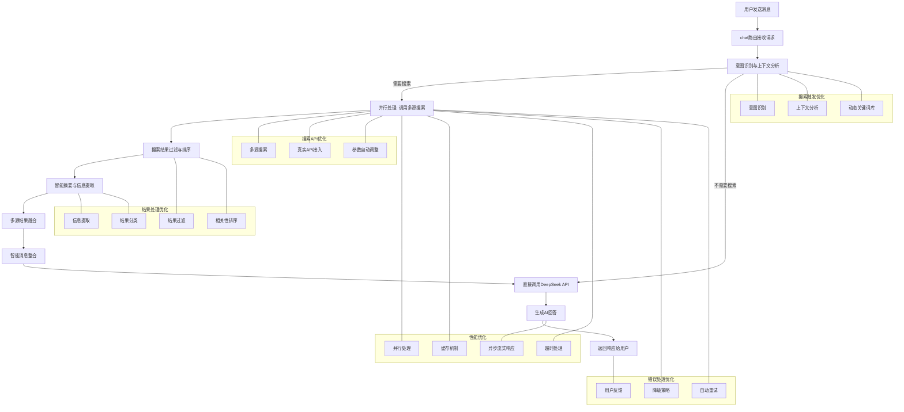

# Yinxin.AGI.ai - 优化后的联网搜索处理流程图

## 优化说明

1. **搜索触发优化**：
   - 引入意图识别和上下文分析，提高搜索触发的准确性
   - 使用动态关键词库，根据用户行为和热门话题调整

2. **搜索API优化**：
   - 接入真实的百度搜索API，提供更准确的信息
   - 实现多源搜索，综合多个搜索引擎的结果
   - 根据查询类型自动调整搜索参数

3. **结果处理优化**：
   - 过滤掉广告和低质量结果
   - 基于相关性对结果排序
   - 提取关键信息，去除冗余内容
   - 将结果按类型分类，便于后续处理

4. **性能优化**：
   - 并行处理搜索和AI调用，减少总响应时间
   - 对常见查询的搜索结果进行缓存
   - 使用异步流式响应，提高用户体验
   - 设置合理的搜索超时时间

5. **错误处理优化**：
   - 搜索失败时使用缓存结果或默认回答
   - 实现自动重试机制，应对临时网络问题
   - 向用户透明地展示搜索状态和结果

## 技术实现要点

- **意图识别**：使用NLP模型或规则引擎识别用户的搜索意图
- **多源搜索**：同时调用多个搜索服务，综合结果
- **智能摘要**：对搜索结果进行摘要，保留核心信息
- **并行处理**：使用Promise.all同时发起多个请求
- **缓存机制**：实现多级缓存，提高重复查询的响应速度
- **流式响应**：使用WebSocket或SSE实现实时反馈

## 预期效果

- **更智能的搜索触发**：减少误触发，提高搜索精准度
- **更丰富的搜索结果**：接入真实搜索API，提供更准确的信息
- **更快的响应速度**：并行处理和缓存机制减少等待时间
- **更友好的用户体验**：实时反馈和清晰的结果展示
- **更灵活的系统架构**：便于扩展和维护

---

*文档版本：v1.0 | 更新日期：2026年5月*  
*© 2026 引信（中国）技术有限公司 版权所有*